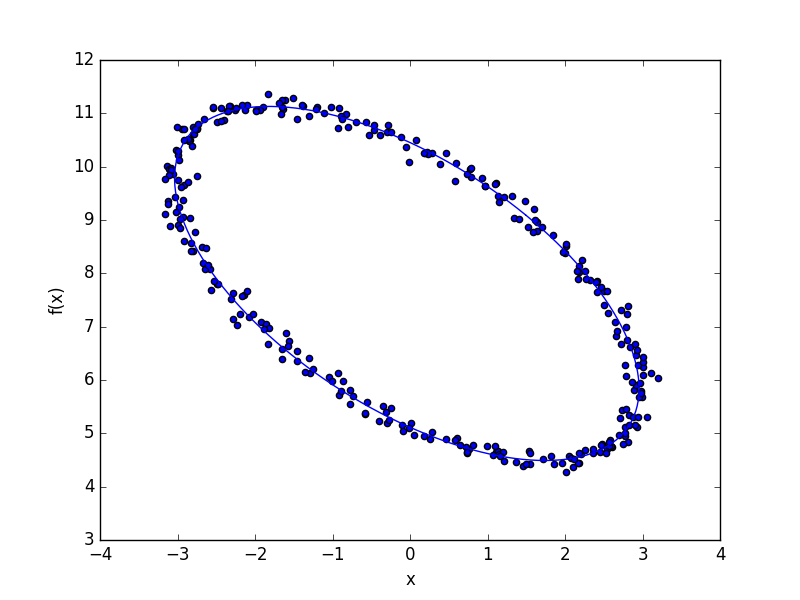

# fgs_opt

Mathematical optimization packages.

Following optimizer are used.

- Ceres-Solver

  <http://ceres-solver.org/>

  ```license
  Ceres Solver - A fast non-linear least squares minimizer
  Copyright 2015 Google Inc. All rights reserved.
  http://ceres-solver.org/

  Redistribution and use in source and binary forms, with or without
  modification, are permitted provided that the following conditions are met:

  * Redistributions of source code must retain the above copyright notice,
    this list of conditions and the following disclaimer.
  * Redistributions in binary form must reproduce the above copyright notice,
    this list of conditions and the following disclaimer in the documentation
    and/or other materials provided with the distribution.
  * Neither the name of Google Inc. nor the names of its contributors may be
    used to endorse or promote products derived from this software without
    specific prior written permission.

  THIS SOFTWARE IS PROVIDED BY THE COPYRIGHT HOLDERS AND CONTRIBUTORS "AS IS"
  AND ANY EXPRESS OR IMPLIED WARRANTIES, INCLUDING, BUT NOT LIMITED TO, THE
  IMPLIED WARRANTIES OF MERCHANTABILITY AND FITNESS FOR A PARTICULAR PURPOSE
  ARE DISCLAIMED. IN NO EVENT SHALL THE COPYRIGHT OWNER OR CONTRIBUTORS BE
  LIABLE FOR ANY DIRECT, INDIRECT, INCIDENTAL, SPECIAL, EXEMPLARY, OR
  CONSEQUENTIAL DAMAGES (INCLUDING, BUT NOT LIMITED TO, PROCUREMENT OF
  SUBSTITUTE GOODS OR SERVICES; LOSS OF USE, DATA, OR PROFITS; OR BUSINESS
  INTERRUPTION) HOWEVER CAUSED AND ON ANY THEORY OF LIABILITY, WHETHER IN
  CONTRACT, STRICT LIABILITY, OR TORT (INCLUDING NEGLIGENCE OR OTHERWISE)
  ARISING IN ANY WAY OUT OF THE USE OF THIS SOFTWARE, EVEN IF ADVISED OF THE
  POSSIBILITY OF SUCH DAMAGE.
  ```

- General Graph Optimization

  <https://github.com/RainerKuemmerle/g2o>

  ```license
  g2o - General Graph Optimization
  Copyright (C) 2011 R. Kuemmerle, G. Grisetti, H. Strasdat, W. Burgard
  All rights reserved.

  Redistribution and use in source and binary forms, with or without
  modification, are permitted provided that the following conditions are
  met:

  * Redistributions of source code must retain the above copyright notice,
    this list of conditions and the following disclaimer.
  * Redistributions in binary form must reproduce the above copyright
    notice, this list of conditions and the following disclaimer in the
    documentation and/or other materials provided with the distribution.

  THIS SOFTWARE IS PROVIDED BY THE COPYRIGHT HOLDERS AND CONTRIBUTORS "AS
  IS" AND ANY EXPRESS OR IMPLIED WARRANTIES, INCLUDING, BUT NOT LIMITED
  TO, THE IMPLIED WARRANTIES OF MERCHANTABILITY AND FITNESS FOR A
  PARTICULAR PURPOSE ARE DISCLAIMED. IN NO EVENT SHALL THE COPYRIGHT
  HOLDER OR CONTRIBUTORS BE LIABLE FOR ANY DIRECT, INDIRECT, INCIDENTAL,
  SPECIAL, EXEMPLARY, OR CONSEQUENTIAL DAMAGES (INCLUDING, BUT NOT LIMITED
  TO, PROCUREMENT OF SUBSTITUTE GOODS OR SERVICES; LOSS OF USE, DATA, OR
  PROFITS; OR BUSINESS INTERRUPTION) HOWEVER CAUSED AND ON ANY THEORY OF
  LIABILITY, WHETHER IN CONTRACT, STRICT LIABILITY, OR TORT (INCLUDING
  NEGLIGENCE OR OTHERWISE) ARISING IN ANY WAY OUT OF THE USE OF THIS
  SOFTWARE, EVEN IF ADVISED OF THE POSSIBILITY OF SUCH DAMAGE.
  ```

- From scratch

  Trying to implement optimization algorithm myself...

# Packages

## fgs_ceres_playground

Optimization samples using Ceres-Solver

## fgs_opt_from_scratch

Written from scratch

## fgs_opt_data_storage

Provide data generator for optimization

Like this



